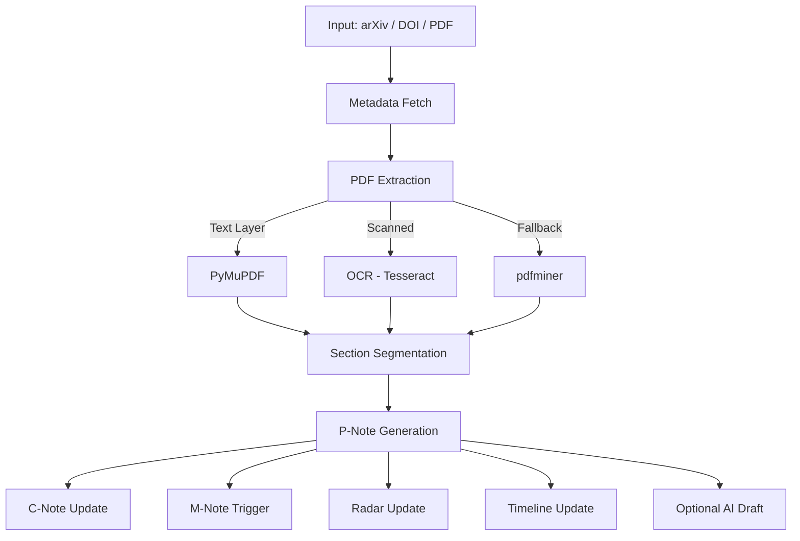
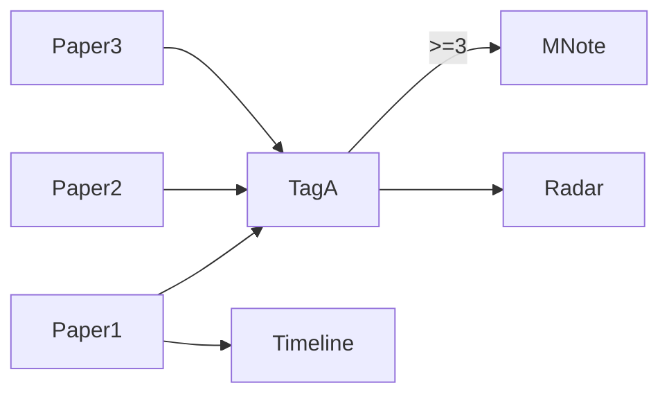

# 🧠 AI Research OS

<div align="center">


**A Structured Research Operating System for Serious AI Researchers**

</div>

---

# 🚀 What Is This?

AI Research OS is a **local-first structured research knowledge system** that:

* Parses academic papers (arXiv / DOI / local PDFs)
* Supports scanned PDFs via OCR
* Automatically builds structured research notes
* Maintains concept evolution
* Triggers comparison notes
* Tracks topic heat via Radar
* Maintains technical evolution Timeline
* Optionally generates AI-assisted structured analysis

This is **not a PDF manager**.

It is a **Cognitive Upgrade System**.

---

# ✨ Core Features

## 📄 Paper Input

| Source                  | Supported   |
| ----------------------- | ----------- |
| arXiv URL               | ✅           |
| arXiv ID                | ✅           |
| DOI                     | ✅           |
| Paid Papers (local PDF) | ✅           |
| Scanned PDFs            | ✅ (`--ocr`) |
| Mixed Chinese/English   | ✅           |

---

## 🧩 Automatic Knowledge Structuring

| Component             | Trigger                  |
| --------------------- | ------------------------ |
| P-Note (Paper Note)   | Every paper              |
| C-Note (Concept Note) | Per tag                  |
| M-Note (Comparison)   | 3 papers under same tag  |
| Radar                 | Topic frequency tracking |
| Timeline              | Year-based evolution     |
| AI Draft              | Optional `--ai`          |

---

# 🏗 System Architecture



---

# 🗂 Project Structure

```bash
AI-Research/
│
├── 00-Radar/
│   ├── Radar.md
│   ├── Timeline.md
│   └── M - ...
│
├── 01-Foundations/
│   └── C - ...
│
├── 02-Models/
│   ├── P - 2024 - ...
│   └── _assets/
│
...
```

---

# 🧠 Knowledge Evolution Logic



---

# 📦 Installation

## 1️⃣ Base Dependencies

```bash
pip install requests feedparser pymupdf
```

---

## 2️⃣ OCR Support (for scanned PDFs)

```bash
pip install pytesseract pillow
```

### Windows Users

Download Tesseract:

[https://github.com/UB-Mannheim/tesseract/wiki](https://github.com/UB-Mannheim/tesseract/wiki)

Enable:

* Add to PATH
* Chinese (chi_sim)

Verify:

```bash
tesseract --version
tesseract --list-langs
```

---

## 3️⃣ Optional Fallback Parser

```bash
pip install pdfminer.six
```

---

# 🚀 Usage

## arXiv Paper

```bash
py ai_research_os.py https://arxiv.org/abs/2601.00155 --tags LLM,Agent
```

---

## DOI Paper

```bash
py ai_research_os.py 10.xxxx/xxxxx --tags Scaling
```

---

## Paid / Subscription PDF

```bash
py ai_research_os.py test --pdf "paper.pdf" --tags RAG
```

---

## Scanned PDF (OCR)

```bash
py ai_research_os.py test --pdf "paper.pdf" --ocr
```

---

## Enable AI Structured Draft

```bash
py ai_research_os.py https://arxiv.org/abs/2601.00155 --tags LLM --ai
```

Set API key:

```bash
set OPENAI_API_KEY=your_key
```

---

# ⚙️ Parameters

| Argument      | Description                |
| ------------- | -------------------------- |
| `--pdf`       | Use local PDF              |
| `--ocr`       | Enable OCR fallback        |
| `--ocr-lang`  | Default `chi_sim+eng`      |
| `--max-pages` | Limit parsing pages        |
| `--ai`        | Enable AI draft            |
| `--model`     | Specify LLM                |
| `--base-url`  | OpenAI compatible endpoint |

---

# 📊 PDF Extraction Strategy

Three-layer extraction system:

1. **Text Layer (PyMuPDF)** — Fast
2. **OCR (Tesseract)** — Scanned PDFs
3. **pdfminer Fallback** — Weird fonts

Success rate (non-encrypted PDFs):

| Type                   | Reliability |
| ---------------------- | ----------- |
| Standard academic PDFs | ~100%       |
| Scanned papers         | ~95%        |
| Mixed language         | ~95%        |
| Font anomalies         | ~90%        |

---

# 🔬 Research Philosophy

This system enforces:

* Structured thinking
* Explicit reasoning
* Comparison-based insight
* Long-term tracking
* Decision logging
* Cognitive iteration

---

# 🧪 Recommended Workflow

1. Read 1 paper daily
2. Assign 1–3 tags
3. Weekly check Radar
4. Auto-trigger comparison notes
5. Quarterly review Timeline
6. Periodically revise M-Notes

---

# 🔮 Roadmap

* Citation graph extraction
* Auto experiment table parsing
* Embedding-based search
* Knowledge graph building
* Trend prediction
* Research momentum scoring

---

# 📜 License

Research & educational use only.

---

# 💡 Final Thought

> Don’t just read papers.
> Don’t just summarize.
> Don’t just tag.
>
> Build evolving structured cognition.
